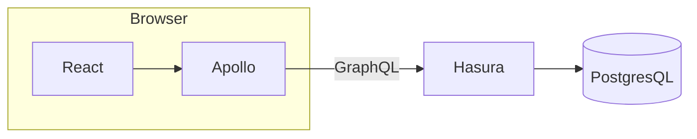

# React website

Just a micro website built using React & Apollo.

It uses a GraphQL API (that I locally serve using hasura.io) to fetch a list of Cats names.

Users may search through them.

## Architecture

## Demo

https://user-images.githubusercontent.com/36550428/209709927-76da29c3-4fcc-4ae5-821c-6f3c0ace8ce9.mp4

