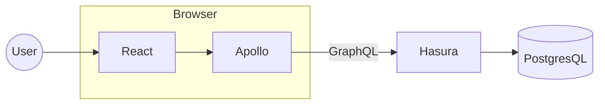

# React website

Just a micro website built using React & Apollo.

It uses a GraphQL API (that I locally serve using hasura.io) to fetch a list of Cats names.

Users may search through them.

## Architecture


## Launching


### Website for development

```sh
$ docker-compose up
```
Will start PostgresQL, Hasura and a node server hosting the website.

### URIs:
* http://localhost:3000 - Website
* http://localhost:8080 - Hasura UI
* localhost:5432 - PostgresQL (user:`postgres`, password:`mysecretpassword`)


### Generating the Typescript files for GraphQL

```sh
% npm run watch
```

Will look for GraphQL queries in the source files and generate the corresponding Typescript types.

## Demo

https://user-images.githubusercontent.com/36550428/209709927-76da29c3-4fcc-4ae5-821c-6f3c0ace8ce9.mp4

